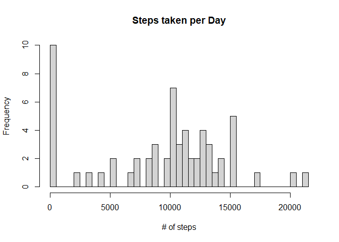
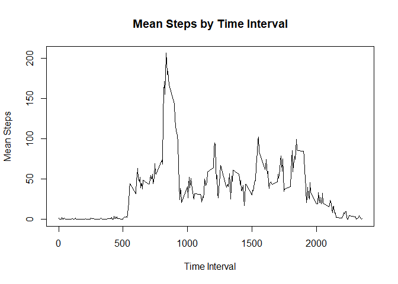
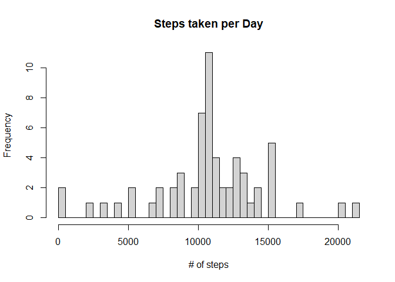
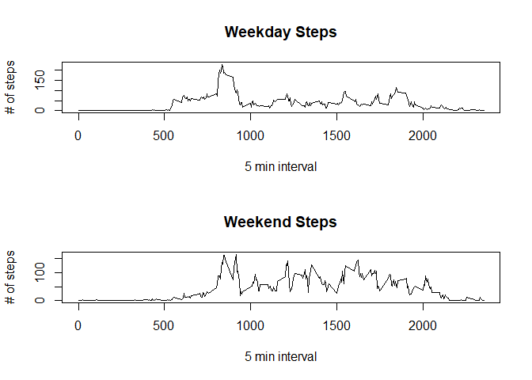

## Loading and preprocessing the data

Let's load our data into R. This is the path on my computer, it will be different on yours:

Let's also re-format the imported table for processing.


```r
data <- read.csv("C:/Users/justi/OneDrive/Documents/R/repdata_data_activity/activity.csv")
    data$steps <- as.numeric(data$steps)
    data$date <- as.character(data$date)
    data$date <- as.POSIXct(data$date)
    data$interval <- as.numeric(data$interval)
```

## Histogram of the total number of steps taken each day

We will first create a data frame of all unique dates. Then, we will fill in the table with the total steps taken on each day.


```r
    daily <- data.frame(date = unique(data$date))
    daily$steps <- NA
    
    for(i in 1:nrow(daily)) {
      daily$steps[i] <- sum(data$steps[data$date == daily$date[i]], na.rm = TRUE)
    }
```

Now that we have a dataframe of dates and steps, we can create a histogram of steps by date.


```r
    hist(daily$steps, breaks = 50, xlab = "# of steps", 
         main = "Steps taken per Day", cex = 0.5)
```

<!-- -->

Let's also generate the mean and median of the daily steps.


```r
    dailymean <- mean(daily$steps)
    dailymedian <- median(daily$steps)
    
    print(dailymean)
```

```
## [1] 9354.23
```

```r
    print(dailymedian)
```

```
## [1] 10395
```

##Activity by Time Interval

How does activity differ throughout the day? Let's make another dataframe, this time attributing steps to the time interval they are associated with. We will then plot the dataframe as a time series.


```r
    minu <- data.frame(minute = unique(data$interval))
    minu$steps <- NA
    
    for(i in 1:nrow(minu)) {
      minu$steps[i] <- mean(data$steps[data$interval == minu$minute[i]], na.rm = TRUE)
    }
   
    #create time series plot
        plot(minu$minute, minu$steps, type = "l", main = "Mean Steps by Time Interval", 
         xlab = "Time Interval", ylab = "Mean Steps")
```

<!-- -->

Which interval has the most steps? Let's find out.


```r
maxstep <- minu$minute[which(minu$steps == max(minu$steps))]
print(maxstep)
```

```
## [1] 835
```

We can see that on average, the 835 interval has the highest amount of steps.

##Filling in Missing Data

We saw that the original dataset has some missing values. How many values are mising?

```r
sum(is.na(data$steps))
```

```
## [1] 2304
```
We can see that 2304 values are missing from the record.

Let's fill them in with the average step count of that specific time interval, as a crude method to insert data.


```r
    datafill <- data
    for(i in 1:nrow(datafill)) {
      if(is.na(datafill$steps[i])) {
        datafill$steps[i] <- mean(datafill$steps[datafill$interval == datafill$interval[i]], na.rm = TRUE)
      }
    }
```

##Histogram of total steps per day, but including the filled values

Now that we have the data, let's repeat the first section and create a histogram of the daily steps.


```r
    dailyfill <- data.frame(date = unique(datafill$date))
    dailyfill$steps <- NA
    
    for(i in 1:nrow(dailyfill)) {
      dailyfill$steps[i] <- sum(datafill$steps[datafill$date == dailyfill$date[i]], na.rm = TRUE)
    }
    hist(dailyfill$steps, breaks = 50, xlab = "# of steps", 
         main = "Steps taken per Day", cex = 0.5)
```

<!-- -->

We can see that this graph is more of a normal distribution than that of the missing values. Let's get the mean and median of this dataset.


```r
    mean(dailyfill$steps)
```

```
## [1] 10766.19
```

```r
    median(dailyfill$steps)
```

```
## [1] 10766.19
```

##Differences in patterns between weekdays and weekends?
Let's see if there are any differences in activity between weekdays and weekends. We will classify each datapoint as a weekday or weekend, then run the code for interval graphing for each subset.


```r
#let's make a column for day of week in dailyfill
    datafill$day <- weekdays(datafill$date)

    #now let's indicate if it's a weekday or weekend
    datafill$weekend <- NA
    datafill$weekend <- ifelse(datafill$day %in% c("Saturday", "Sunday"), 
                                  "weekend", "weekday")
    #find mean of intervals by weekday or weekend
    dowinterval <- data.frame(minute = unique(datafill$interval))
    
    dowinterval$weekday <- dowinterval$weekend <- NA
    
    for(i in 1:nrow(dowinterval)) {
      dowinterval$weekday[i] <- mean(datafill$steps[(datafill$interval == dowinterval$minute[i]) 
                                            & (datafill$weekend == "weekday")] , na.rm = TRUE)
      dowinterval$weekend[i] <- mean(datafill$steps[(datafill$interval == dowinterval$minute[i]) 
                                            & (datafill$weekend == "weekend")] , na.rm = TRUE)
    }
 
    #make the graph
    par(mfrow=c(2,1))
    plot(dowinterval$minute, dowinterval$weekday, type = "l", main = "Weekday Steps",
         xlab = "5 min interval", ylab = "# of steps")
    plot(dowinterval$minute, dowinterval$weekend, type = "l", main = "Weekend Steps",
         xlab = "5 min interval", ylab = "# of steps")
```

<!-- -->


We can see that there are generally more steps taken throughout the day during the weekend, while weekdays generally have a large peak of steps in the morning and lower counts afterwards.


